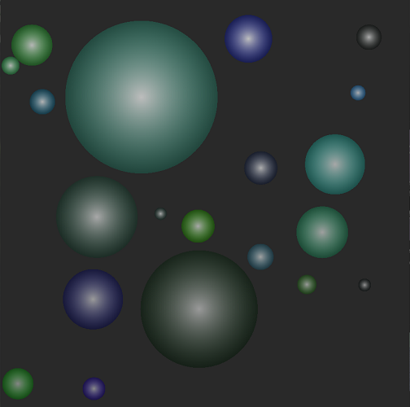

# Particles simulator

This project is a simple simulator of ball collisions in 2D. It is made in C++ and is using OpenGL for graphics rendering. Some OpenGL's codebase has been taken from my other project - [round-pong](https://github.com/bartos97/round-pong).
It originates as a project for University which point was to get familiar with Memento Design Pattern (used for saving and recovering state of all particles in simulation).

Particles have following properties:
- `position` (2D vector): coordinates of center of a particle
- `radius` (float): self-explanatory
- `speed` (2D vector): vector that describes **displacement** of a particle per second
- `color` (4D vector - RGBA): self-explanatory

Coordinate system used here is the **normalized device coordinates** system used in OpenGL, that is: values go from `-1.0` to `1.0` in both `x` (horizontal) and `y` (vertical) axes. Origin is in the middle of the board; board is square even if OS windows is not.

## How to clone
When cloning repo make sure you're using `--recurse-submodules` flag.

## How to run
Use `run.bat` script. It's in root directory. You can pass command line options, described below.

### Command line options
- `--num` (default: `10`) how many particles to generate
- `--path` (default: `state.csv`) path to file (relative to root directory) in which simulation state can be stored and loaded
- `--speedFrom` (default: `-0.5`) lower bound of range in which each component of speed vector, for each particle, will be randomly selected. Valid values are from `-2.0` to `2.0`
- `--speedTo` (default: `0.5`) upper bound of thing described above. Valid values are smaller or equal to `2.0` and greater than `--speedFrom`.
- `--radiusFrom` (default: `0.025`) lower bound of range in which radius, for each particle, will be randomly selected. Valid values are from `0.025` to `0.5`
- `--radiusTo` (default: `0.2`) upper bound of thing described above. Valid values are smaller or equal to `0.5` and greater than `--radiusFrom`.

## UI
There is no GUI, so in order to communicate use keyboard:
- `SPACE` start/stop simulation
- `S` save simulation state to file
- `L` load simulation state from file
- `ESC` close window

All feedback informations are logged in the console.
